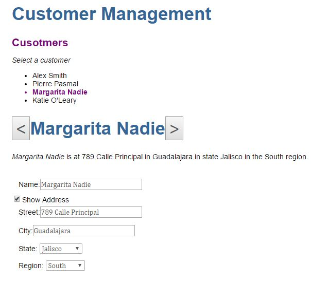

# Code with Us: Angular Quick Start

This is an Angular 2 Application which is based on the pluralsight course [Code with Us: Angular Quick Start by Ward Bell and John Papa](https://app.pluralsight.com/library/courses/code-with-us-angular-quick-start/table-of-contents)

The below are follow along comments as John Papa and Ward Bell build a form-based, customer management app from scratch. We have created a visual components that display data and respond to user input with data binding, write a service to retrieve the data over HTTP, and more.

Below is the screenshot of the working application.




# How to run the application

* Download the code as a zip or git clone
* npm start


# Chapter 1 - Setting up Angular quickstart


* [Course Code downloaded here locally under apps folder](D:\courses\angular2\apps\code-with-us-angular-quickstart)

* [Read the readme for code setup and other useful instructions](D:\courses\angular2\apps\code-with-us-angular-quickstart\code-with-us-angular-quickstart\README.md)

* As per instructions, got the setup for the initial quickstart module done from [github of angular quickstart](https://github.com/angular/quickstart)
  - Downloaded [code in local folder to start the setup and start building your application](D:\courses\angular2\apps\code-with-us-angular-quickstart\code-with-us-my-project\quickstart-myproj)
  - Followed the read me to download and upload to my github repo
  - now installing npm packages and then restarted the server by npm start. ALl as per the instructions.
  - The Hello Angular appears in browser. http://localhost:3000/

* git commands that will set the thing up and make sure that you push your changes to remote repository.

```
git remote add origin <repo-address>
git push -u origin master

git pull
git add .
git commit -m "your message"
git push

```
* Played around with developer tools

* Moved the main.ts inside the app folder. So, updated the index.html accordingly

  ```
  <script>
    //System.import('main.js').catch(function(err){ console.error(err); });
    System.import('app/main.js').catch(function(err){ console.error(err); });
  </script>
  ```

* Visual code editor changes
  - Updated the IDE version
  - Enabled auto sava
  - Updated the settings so that the js file and js.map file doesn't get shown when we have corresponding ts file.

  ```
  {
    "files.autoSave": "afterDelay",
    // Configure glob patterns for excluding files and folders.
    "files.exclude": {
        "**/.git": true,
        "**/.svn": true,
        "**/.hg": true,
        "**/.DS_Store": true,
        "**/*.js" : {
            "when": "$(basename).ts"
        },
        "**/*.js.map" : {
            "when": "$(basename)"
        }

    }
}
  ```

* Application Flow understood
  - main.ts
  - app.modules.ts
  - app.component.ts

  - Copied the app-styles.css from the tutorial / pluralsight code and updated locally to styles.css


# Chapter 2 - Simple Binding

## Property Binding

* Started playing around with images and added a favicon.ico image and accessed

* {{image}} is accessed from inside the template. Note that this 'image' is one of the property in the AppComponent class.

* "{{image }}" or {{image}} both works. This kind of curly braces to access the class AppComponent property is called _interpolation_

  - This is called property binding.This is preferred way

  ```
  
  ```

* Adding a label and then using to change the color of text
  - Added a property for color = red in AppComponent
  - And accessed it in label as below
  - [] this way we did property binding

  ```
  <label [style.color]="color">Favorite Color:</label>{{color}}
  ```

## Event Binding

* Adding an event on button (event handler) which will change the color when clicked.
* here is the code. note that we added the event binding via clicked() (note the () in the end). This is fired on click of button.

```
//IN the HTML template
<button (click)="clicked()">Toggle Color</button>

//A function in the AppComponent class
clicked() {
  this.color = this.color == 'red' ? 'blue' : 'red';    
}
```

>**Note:** till now this is all one way communication

* We can create a variable inside the template which is only accessible here.
  - It is done via # (pound symbol). See the #selector as a variable,
  - selector.value gives me the selected value which gets passed to the colorChange(selector.value) function

```
//IN the HTML template
<select #selector (change)="colorChange(selector.value)" >
  <option>red</option>
  <option>blue</option>
  <option>green</option>
</select>

//A function in the AppComponent class
colorChange(color : string) {
  this.color = color;
}


```

* Angular also emits the DOM events as *$event* (dollar event) - We will now use this way to achieve the above result. This is the classic way to achieve the problem. So, we will stick to it.

>$event.target is same as #selector
> and $event.target.value will give the same effect as selector.value

```
<select (change)="colorChange($event.target.value)" >
  <option>red</option>
  <option>blue</option>
  <option>green</option>
</select>


```

## Exercises: Simple Binding

* Add a *street*, *city* and *region* properties to the *AppComponent* class
* Bind to *street* and *city* in the template with {{interpolation}}
* Add Show/Hide address" button to template
* Add *hideAddress* property, initialized to *false*
* Add *addressClick* method that toggles *hideAddress*
* Bind its *(click)* event to *addressClick* method
* Bind *[hidden]* property of the *<div>* around address to *hideAddress*
* Add *"Region"* < select > with "East", "North", "South", "West" < option >s
* Bind the *(change)* event of the region < select >* to *regionChange* method
* pass it the value of the event's target
* Add *regionChange* method that sets the region property
* Add < p > tag explains who is in what region, using {{interpolation}}

**Note:**
* Mostly the same what we learnt. Here is how we did property binding for div.

```
<div [hidden]="hideAddress">
```

* The default value for region is not selected, so nothing comes. We have to do this. Set the inital value defined.

# Chapter 3 - Two-way Data Binding

## Binding with Input

* Use input box and change the name property using the *input* event.
* When user types, the *input event gets fired*.
* we are using the #namebox which is just a way to define / declare a variable which we can use to get the value typed in the text box.
* When the *(input) event*, gets fired, just at that time, assign the value in the namebox variable (i.e. text box) to the *AppComponent* *name* property
* Here the event handling is done in the html code itself.

  ```
    <input #namebox [value]="name" (input)="name=namebox.value"><br/>
  ```

  >$event.target is same as #namebox
  > and $event.target.value will give the same effect as namebox.value

* we will eventually go and change it use $event.target.value so that we don't need to define this variable as we did above in all the text boxes.

  ```
  <input [value]="name" (input)="name=$event.target.value"><br/>
  ```

* We have in inputbox some event as *(keyup)*, we can bind the same function to that as well.
  ```
  <input [value]="name" (keyup)="name=$event.target.value"><br/>
  ```
* The useful aspect of this is - in angular we have some well known properties available here to be used with keyup. So, we want that the above desired result happen when user hit enter. We can achieve that using *keyup.enter*

  ```
  <input [value]="name" (keyup.enter)="name=$event.target.value"><br/>
  ```

* Data binding on enter and lost focus. When user goes away from the text box and the event is *blur*, we want to fire the same event here. I mean, we need to have the same event gets fired on two different events. In this case, when user hits enter or he blurs. We can do this as well in angular.
  ```
  <input [value]="name" (keyup.enter)="name=$event.target.value"
                        (blur)="name=$event.target.value"><br/>
  ```
* In earlier cases, *click* event for button was handled using the method defined in the *AppComponent*
The name of the method was clicked()

  ```
  <button (click)="clicked()">Toggle Color</button>
  ```

## Binding with ngModel

* We need FormsModule, so we made the following changes in the *app.module.ts*
  - First, imported the FormsModule
  - Second, In the @NgModule decorator, mention it.
  - FormsModule is needed for using the *ngModel*

```
**1**
import { FormsModule} from '@angular/forms';

**2**
@NgModule({
  imports:      [ BrowserModule, FormsModule ], // what stuffs do i need?

```

* Now, we can use *ngModel* for two way binding. The following two lines now become equivalent.

  ```
  <input [value]="name" (input)="name=$event.target.value"><br/>

  <input [(ngModel)] ="name"><br/>

  ```

* Going back to the original way of doing it. Note the following.
  - using *ngModel* property and *ngModelChange* event.
  - Event handling function is inline and here we are just accessing the value by $event. The value is assigned internally.

  ```
  <input [ngModel]="name" (ngModelChange)= "name=$event"><br/>
  ```


## Exercise - Lesson 3 Two way data binding

* Bind to *street* and *city* to <input> tags with *[(ngModel)]*
* Bind to *region* in the *< select >* with *[(ngModel)]*
* Remove all *name* binding variations except the one using [(ngModel)]

**Review and next steps**

* For accessibility purpose, prefer to have input inside the label
  ```
  <label>City:<input [(ngModel)]="city"></label><br/>
  ```
* Note the difference between the below two. [ngModel] vs [(ngModel)]

  ```
  <label>Name:<input [ngModel]="name" (ngModelChange)= "name=$event"></label><br/>

  <label>Street:<input [(ngModel)]="street"></label>
  ```
* For a quick check/diagnosis, you can use the < pre > tag with pipe and json.

  ```
    <pre> {{street | json}}</pre>
    <pre> {{city | json}}</pre>
  ```

* Finally, updated the {{city}} and {{street}} in the header text.

  ```
      <p><i>{{name}}</i> is at {{street}} in {{city}} in the {{region}} region. </p>
  ```

* As we have now done the two - way binding. So, we don't need regionChange() method.
  We also don't need addressClick () because we have replaced the button with checkbox. And the checkbox two way binding will take care of toggle effect itself.
  So, removing the below funcitons.

  ```
    //toggles hideAddress property
    addressClick() {
      this.hideAddress == false ? this.hideAddress = true : this.hideAddress = false;
    }

    regionChange(region:string) {
      this.region = region;
    }
  ```

  * using [(ngModel)] cleans the template and code. So, this should be the preference.

# Chapter 4 - Models

## Moving from component to Data Models

* You will ultimately be getting a customer from some service. So, we should have  a model for the customer instead.
* Create a model for a customer. Put the instance of that model in the component.
  - A model will be in its own file. model.ts - makes sense. it will be accessed at more than one places.
  - Here in this example, we are doing in a generic model.ts but ideally each model will go in its own class.
  - the customer class should be prefixed with *export* as we need it in *AppComponent*
    ```
    export class Customer {

    }     

    ```
* Import the model in AppComponent.
  ```
  import { Customer } from './model';
  ```

* Add another class Address. The customer class will compose it. Adjust the properties accordingly. e.g. Customer will contain (id, name and Address) whereas Address represents (street, city, state and region)

* There are two ways to create an instance of this customer object in AppComponent.

  ```
  //1
  customer: Customer = new Customer();

  //2
  customer1 : Customer = { };
  ```  
    - We prefer the second one. Typescript implicitly understands the intent.
    - Inside the { }, we need to assign all the properties.


## Refactoring to template files

**Moving inline code to Template files**

* Moving from an inline template to a template file.
* Recommendation - template file should be of the same name as component. It will have .html extension.
* Here is the change`
  - INstead of template in decorator, it is now templateUrl - it refers to the newly created file
  - add moduleId:module.id, (to tell the app to start looking relative to the module/component)

  ```
  @Component({
    moduleId:module.id,
    selector: 'my-app', //this is what that will be shown in the html tag. it is like css selector as in jquery.
    templateUrl: 'app.component.html',
  })
  export class AppComponent  {

  ```
* We can have a separate CSS file as well. We will create in the same way, a app.component.css file.
* Refer it in the component via *styleUrls: ['app.component.css']*  - this is an array here because you may have more than one CSS.
* These styles are private to this component only.
* Added a h1 style for this component and when you use this h1 tag in say index.html, it will still be the original / root style.
* The new style only applies to this component only. Idea is that the components gets shared across, so the styles if not private, will also keep mingling.

# Chapter 4 - List Binding

## "ngFor" - List Binding with \*ngFor and \*ngIf

* We need to remove the hardcoded regions.
* add regions in Component and refer it in HTML

  ```
  export class AppComponent  {

      regions = ['east', 'south', 'north', 'west', 'midwest'];
  ```
* Use \*ngFor - which is like a for loop in the template file.
  - Similarly, we can have states changed.

  ```
  <fieldset>
     <label>Region:</label>
     <select [(ngModel)]="customer.address.region" >
      <option *ngFor="let region of regions">{{region}}</option>
      </select>
  </fieldset>
  ```

* Created a customer array of four sample records. Then, assigned the first to the customer variable.

  ```
  customer : Customer = this.customers[0];
  ```
* Now, the below uses for loop to print all the customers in the list.
  - each customer gets stored in local variable cust
  - on click on each of this customer name, the model (customer) is set to cust which is the clicked object.
  - Now, the model will be used to display the clicked customer detail.

  ```
  <ul>
      <li *ngFor="let cust of customers" (click)="customer=cust">{{cust.name}}</li>
  </ul>

  ```
* We want to highlight the selected customer in the list.
  - We will add a property binding on the list of customer names.
  - We will use [ngClass] which will try to add a property binding - it will load the class "selected" from css if customer===cust is true. Otherwise, it will remove this class from this.

  ```
  <ul>
    <li *ngFor="let cust of customers"
    [ngClass]="{selected: customer===cust}"
    (click)="customer=cust">{{cust.name}}</li>
</ul>

  ```
  - we will go ahead and add this css class.

  ```

  ```

## Lesson 4 List binding Exercise

* Use \*ngIf instead of display true / false. When we use like below and inspect the dom, we find that it just hides in the dom whereas, when we use \*ngIf, angular will remove the content from the DOM itself.

* This exercise is all about replacing the below with \*ngIf

  ```
   <div [hidden]="hideAddress">
  ```
* We will also change hideAddress to showAddress and make necessary changes in controller and html
  ```
      <div *ngIf="showAddress">
  ```

# Multiple components

## Nested components

* App component should be just like a shell... not doing something. But here we have many thing inside it.
* We will go with more than one components here. like customer list and customer details components.
* Install **Angular2 Typescript snippet** extension in visual studio code. (to help get some auto-generated code)


* CusomterList is accessing the customer property in CustomerDetail. So, in the CustomerDetail where the customer property is defined, make sure to have it decorated with @Input()
* Refer the segregated code where we now have following structure.

* appComponent has a title and loads the CustomerListComponent. For this, it

```
@Component( {
    moduleId: module.id,
    selector: 'my-app',
    template: `
    <h1>{{title}}</h1>
    <customer-list></customer-list>

    `
})
export class AppComponent {
    title ='Customer Management';
}
```

* CustomerListComponent has a list of customers and a customer property to hold the selected customer value

```
@Component({
  moduleId:module.id,
  selector: 'customer-list', //this is what that will be shown in the html tag. it is like css selector as in jquery.
  templateUrl: 'customer-list.component.html',
  styleUrls :['customer-list.component.css']
})
export class CustomerListComponent  {

  customers: Customer[] = [
    {
    //customer 1  
    },
    {
    //customer 2  
    },
    {
      //customer 3
    }
  ];
  customer : Customer; //selected customer
}
```

* selected customer detail will get displayed by CustomerDetailComponent. So, customer-list.component.html is shown below.
  - selected customer in the list gets bounded to the customer property of CustomerDetailComponent.
  - In order to set a property of a component from another component, the property in a component which will be set from outside should be decorating that component property as @input.

```
<h1>Cusotmers</h1>
<div>
    <p><i>Select a customer</i></p>
    <ul>
        <li *ngFor="let cust of customers"
        [ngClass]="{selected: customer===cust}"
        (click)="customer=cust">{{cust.name}}</li>
    </ul>


    <!-- details begin here -->
  <div *ngIf="customer">
    <customer-detail [customer]="customer"></customer-detail>
  </div>
</div>
```
  - Hence, the customer property in the CustomerDetailComponent is decorated with
  ```
    @Input() customer : Customer;
  ```

## Lesson 5 : Nested components

* **Goal** : refactor the customer address into an AddressComponent

  - Create a new AddressComponent in the 'app' folder with the selector <Address-comp>
  - Give it an address property that is an @Input()
  - Bind the address property of the AddressComponent to the CustomerListComponent customer's address
  - Replace the address HTML in the CustomerListComponent with the proper AddressComponent tag
  - Remember to declare the AddressComponent in the AppModule.


# @Output

* **Goal** : Communicating from child to parent. Customer detail wants to have a control for left and right movement say - when it is clicked, it will communicate to parent to move to previous or next record.

* For going down we used @Input() for going up, it will be @Output()

* [CustomerDetailComponent.html](https://github.com/toneeraj/ng2-quickstart-myproj/blob/master/src/app/customer-detail.component.html) will have left and right button

  ```
   <h1><button (click)="left()"><</button>{{customer.name}}<button (click) = "right()">></button></h1>
  ```

* [CustomerDetailComponent](https://github.com/toneeraj/ng2-quickstart-myproj/blob/master/src/app/customer-detail.component.ts) will be emitting an event.
  - Inport the EventEmitter and Output
  - Create an instance of new EventEmitter<number>();
  - Use the emit() method 'this.shift.emit(1);'  to send the values passed in the parameter of emit method

  ```
  import { Component, EventEmitter, Input, Output } from '@angular/core';//importing the decorator which I need

  @Output() shift = new EventEmitter<number>();

  right() {
    this.shift.emit(1);
  }

  left () {
    this.shift.emit(-1);
  }
  ```
* [Parent (CustomerListComponent)](https://github.com/toneeraj/ng2-quickstart-myproj/blob/master/src/app/customer-list.component.ts) will be listening to the event emitted by child (CustomerDetailComponent)

  ```
   <customer-detail [customer]="customer" (shift)="shift($event)" ></customer-detail>
  ```
  - Here is the handler

  ```
  shift(increment : number) {
     let ix = this.customers.findIndex( c => c ===this. customer) + increment;
     ix = Math.min(this.customers.length-1, Math.max(0, ix));
     this.customer = this.customers[ix];
   }
  ```

* [Commit Change details with all the changes can be seen here on github](https://github.com/toneeraj/ng2-quickstart-myproj/commit/c5c36b9c7c83b767ca27a6ce9659466c6f675558#diff-839f6185e78b2cbaaf475e8616562421)


# Services & Dependency Injection

## Creating Services


* **Goal** :
  - Take hard coded data and put inside a service.
  - Create a service for test customer data
  - Inject the above service inside CustomerListComponent

* Create a file test-data.ts.
  - Let us put our test data out somewhere in a file.

* Create data.service.ts class
  - by convention, this class will have decorator @Injectable.
  - Purpose of this class is to get stuff. In this case, getCustomers()

* Let angular inject this service inside the CustomerListComponent
  ```
  constructor (private dataService : DataService) {}
  ```
* Utilize angular lifecycle method ngOnInit() for components which will get called by Angular.
  - For this, CustomerListComponent class should implement the *OnInit* class

  ```
  ngOnInit() {
    this.customers = this.dataService.getCustomers();
  }
  ```
* "No Provider for DataService" : we haven't told angular how to create it.
  - In the app.module.ts, we need to Import the DataService
  - Use *providers* in decorator. It has a special property in the meta data called as *providers* for services.

[Github commit link for this change](https://github.com/toneeraj/ng2-quickstart-myproj/commit/849a5e3ce3a504d5a2025c49bdec0feb1fe83f9c#diff-fc6b22833aeaf77f8440c4970ade705e)

## Lesson 6: Exercise on service and Dependency Injection

**Exercise tasks**
* Create a *LoggerService* class in *app/logger.service.ts*
* Give it a *log* method that takes a string and logs to the console
* Remember the decorator that all service classes should haven
* Provide it in the *AppModule*
* Inject it in *CustomerListComponent*.
* Call it in *ngOnInit* so it logs *'Getting customers ...'*
* Inject it in *DataService* and call it whithin *getCustomers* so it logs how many customers it got.

[Github commit link for the changes done in this exercise](https://github.com/toneeraj/ng2-quickstart-myproj/commit/6b3d1fa5772d63d65cd89b26f460b6eb43bc8e89#diff-8884d04ac0da85ac765425a39c63023b)


# Asynchronous Angular

## Async with Promises

* **Goal** Use Promises in service
  - getCustomers() method in the data.service.ts now returns a promise.
  ```
  //Returning a promise. Need to be of Customer[]. otherwise typecast error while using it.
       return new Promise<Customer[]>(resolve => {
           setTimeout(() => {
                this.loggerService.log(`Got ${customers.length} customers `);
                resolve(customers);
           }, 1500);
       });
  ```
  - CustomerListComponent will be updated to consume this return type as a promise

  ```
  getCustomers() {
    this.loggerService.log('Getting customers...');
    //Using promise.
    this.dataService.getCustomers().then ( custs => {
      this.customers = custs;
    });
  }
  ```
  - [Github changes in code of implenting promises](https://github.com/toneeraj/ng2-quickstart-myproj/commit/27f3358d7309754d0ce273eb76e397eeec4f8665#diff-cd8c363f3801d40d4633c48c21f1732c)

* **Goal** Handle the scenario - till the time data gets loaded, user should get appropriate message.
  - create isBusy in customer-list.component.ts
  - When you enter getCustomers() method in CustomerListComponent, you are busy but when you get response, you are not busy

  ```
    getCustomers() {
  --->  this.isBusy = true;
    this.loggerService.log('Getting customers...');
    //Using promise.
    this.dataService.getCustomers().then ( custs => {
      ---> this.isBusy = false;
      this.customers = custs;
    });
  }
  ```
  - Update the corresponding html file to display the message appropriately using \*ngIf

  ```
    <p *ngIf="isBusy"><i>Loading customers ...</i></p>
    <p *ngIf="!isBusy"><i>Select a customer</i></p>
  ```
  - [Github commit changes in code for this](https://github.com/toneeraj/ng2-quickstart-myproj/commit/a74dec1b7d151f32aa83ed6f53280b162066a0f0)


## Async with Obervables

* **Goal** : Implement async using Observable
  - Import the following required for Observable.

  ```
  import { Observable } from 'rxjs/Observable'; //Observable
  import { of } from 'rxjs/observable/of';
  ```

  - Importing 'delay' & do directly from the file. Note that, it is something similar as extension functions in Kotlin or C#

  ```
  import 'rxjs/add/operator/delay';
  import 'rxjs/add/operator/do';
  ```
  - In Data service class, let us use Obervables

  ```
  getCustomers(): Observable<Customer[]> {
      this.loggerService.log(`Getting customers as a Observable ...`);
      const customers = createTestCustomers();
      return of(customers)
          .delay(1500)
          .do(()=> {
            this.loggerService.log(`Got ${customers.length} customers `);   
          });
  }
  ```
  - In the CustomerListComponent, getCustomers() method, you use *subscribe*

    ```
     this.dataService.getCustomers().subscribe( custs => {
    ```
  - Promises are in built in JavaScript. Whereas, Observable is a library that we use.

  - [Github commit changes in code for Observable implementation](https://github.com/toneeraj/ng2-quickstart-myproj/commit/88673b5a84ab07fe3a4cad21c18ac98d868a401d)

# HTTP Service

## Working with http

* **Goal**
  - Use In-built mock HTTP server to test / simulate the HTTP Service
  - Use HTTP service with Promises
  - Add error handling for promises

* Create in-memory data service (in-memory-data.service.ts) to simulate how the database looks like.

```
import { InMemoryDbService} from 'angular-in-memory-web-api';

import { createTestCustomers } from './test-data';

export class InMemoryDataService implements InMemoryDbService {
    createDb () {
        return { customers : createTestCustomers() }
    }
}

```
* Import the respective modules in App.module.ts

```
//Follwoing is only for the development
import { InMemoryWebApiModule} from 'angular-in-memory-web-api';
import { InMemoryDataService } from './in-memory-data.service';


@NgModule({
  imports: [BrowserModule, // what stuffs do i need?
  FormsModule,
  InMemoryWebApiModule.forRoot(InMemoryDataService)], //Only for dev server. WIll help use HTTP without actual HTTP

```

* HTTP has promise as well as observable path. We will use the Promise path first.

**Let us use Http with promise.**

*  Uncomment promises in CustomerListComponent

* In the data.service.ts, we will use the promises version.
  - Import the Http and headers and then inject it

```
import { Http, Headers } from '@angular/http';

constructor(private loggerService: LoggerService,
    private http : Http) { }

```

* Tell Angular that we are using http. So, go to app.module and import

```
import { HttpModule } from '@angular/http';

@NgModule({
  imports: [BrowserModule, // what stuffs do i need?
  FormsModule,
  ---> HttpModule,
```


* Update the getCustomersP() method.
  - By default, http get call returns observable. We call toPromise() method to convert to Promise.
  - Need to import toPromise

  ```
  import 'rxjs/add/operator/toPromise';
  ```

  - The entire method code below with http error handling.

  ```
  getCustomersP(): Promise<Customer[]>  {
      this.loggerService.log(`Getting customers as a Promise ...`);

      //Call http get. By default it returns observable. Calling method to convert to Promise.
      return this.http.get(this.customersUrl)
      .toPromise()
      .then(response => { //customer data is embedded in response. The data property gives me desired result.
          const custs = response.json().data as Customer[];//cast as cusotmer[]
          this.loggerService.log(`Got ${custs.length} customers `);
          return custs;
      },
      error => {
          this.loggerService.log(`Error occurred: ${error}`);
          return Promise.reject('Something bad happened. Please check the console.');
      }

      );

  ```

* In CustomerListComponent, we need to now handle the error scenario as well which the promise is now returning.
  - The second parameter is handled as an error.
  - We are only using aler for demo.

```
getCustomers() {
  this.isBusy = true;
  this.loggerService.log('Getting customers...');
  //Using promise.
  this.dataService.getCustomersP().then ( custs => {
  //  this.dataService.getCustomers().subscribe( custs => {
    this.isBusy = false;
    this.customers = custs;
  }, (errorMsg: string) => {
    this.isBusy = false;
    alert(errorMsg); //TODO : never do an alert
  });
}
```

* To simulate the error case, we need to change the URL in dataService
  - Note the alert message
  - note the logger error message in console. "Error occurred: Response with status: 404 Not Found for URL: api/customersXYZ"
  - Now, change the URL back to correct one.

```
  private customersUrl = 'api/customersXYZ';
```

* [Http with promises commit changes on github](https://github.com/toneeraj/ng2-quickstart-myproj/commit/352ec65e9c82fcdc1032fe2c90f0f36a4c9d0f54#diff-fc6b22833aeaf77f8440c4970ade705e)

**Let us use Http with Observable.**

* **Goal**
  - Use In-built mock HTTP server to test / simulate the HTTP Service
  - Use HTTP service with Observables
  - Observables is the recommended way

* Create in-memory data service (in-memory-data.service.ts) to simulate how the database looks like.

  ```
  import { InMemoryDbService} from 'angular-in-memory-web-api';

  import { createTestCustomers } from './test-data';

  export class InMemoryDataService implements InMemoryDbService {
      createDb () {
          return { customers : createTestCustomers() }
      }
  }

  ```

* Import the respective modules in App.module.ts

    ```
    //Follwoing is only for the development
    import { InMemoryWebApiModule} from 'angular-in-memory-web-api';
    import { InMemoryDataService } from './in-memory-data.service';
    ```

    ```
    @NgModule({
      imports: [BrowserModule, // what stuffs do i need?
      FormsModule,
      InMemoryWebApiModule.forRoot(InMemoryDataService)], //Only for dev server. WIll help use HTTP without actual HTTP

      ```

* In the data services, now we will use the Observable with Http

```
getCustomers(): Observable<Customer[]> {
    this.loggerService.log(`Getting customers as a Observable via Http...`);
-->    return this.http.get(this.customersUrl)
-->    .map( response => response.json().data as Customer[])
    .do((custs)=> {
       this.loggerService.log(`Got ${custs.length} customers `);   
     });
}

```
* Subscribe also has two parts, - handle the happy path and the error path. So, just switch to the subscribe version (handling Observable response)

```
getCustomers() {
  this.isBusy = true;
  this.loggerService.log('Getting customers...');
  //Using promise.
  //this.dataService.getCustomersP().then ( custs => {

  //Using Observable
    this.dataService.getCustomers().subscribe( custs => {
    this.isBusy = false;
    this.customers = custs;
  }, (errorMsg: string) => {
    this.isBusy = false;
    alert(errorMsg); //TODO : never do an alert
  });
}
```

* [Github commit details](https://github.com/toneeraj/ng2-quickstart-myproj/commit/cf243d4cf1648298e0883f639ecc86cb8c12b2d7#diff-4332cea4112c8f8b67046cb221632243)

## Lesson 7: HTTP Services - Exercises

* **Goal** Add states as a service.

  - Add the states (from *AddressComponent*) to the *in-memory-data.service*

  ```
  createDb() {
    const states = ['California', 'Quebec', 'Jalisco', 'West', 'Illinois'];
    retrurn { customers: createTestCustomers(), states };
  }
  ```

  - Add *getStates* to *DataService*(imitate *getCustomers*).
  - Inject *DataService* into the *AddressComponent*
  - Use *getStates* to assign *states*
    (imitate *getCustomers* in *CustomerListComponent*)

* Add error handling in observables.

```
getStates() : Observable<string[]> {
         this.loggerService.log(`Getting states as a Observable via Http...`);
         return this.http.get(this.statesUrl)
         .map( response => response.json().data as string[])
        .do((states)=> {
           this.loggerService.log(`Got ${states.length} states `);   
         })
--->         .catch((error: any) => {
--->          this.loggerService.log(`Error occurred: ${error}`);
--->            return Observable.throw('Something bad happended. Please check the console.');
         });
```

* Also, noticed that we should be using uppercase 'O' in Observable import in DataService.

  ```
  import { Observable } from 'rxjs/Observable';
  ```

* Tested with happy and unhappy path by changing the states URL to something else.

* [Github commit details](https://github.com/toneeraj/ng2-quickstart-myproj/commit/14fb051d86061b97ca1b2b708c292fdf627db52b)


# References:

* [Pluralsight course - Code with Us: Angular Quick Start by Ward Bell and John Papa](https://app.pluralsight.com/library/courses/code-with-us-angular-quick-start/table-of-contents)

* [Pluralsight course sample code on github](https://github.com/wardbell/code-with-us-angular-quickstart)

* http://stackoverflow.com/questions/1221840/remote-origin-already-exists-on-git-push-to-a-new-repository

* [github of angular quickstart](https://github.com/angular/quickstart) - Refer the read me for setting up the code in your remote github repo.
